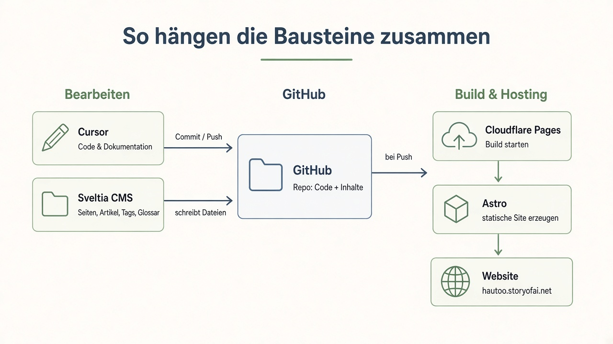
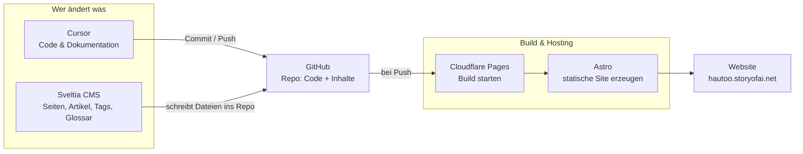

# Konzept

## Ziel

Menschen sollen eine thematische Website **selbst erstellen und pflegen** können — ohne klassisches Webentwicklungs-Studium, aber mit klaren Werkzeugen:

- **Cursor** als KI-Assistent für Code und Dokumentation
- **GitHub** als Quellcode- und Inhaltsarchiv
- **Cloudflare** als Hosting und Deployment
- **Astro** als Generator der statischen Website
- **Sveltia** als CMS für strukturierte Inhalte

## So hängen die Bausteine zusammen

Cursor und Sveltia speisen **GitHub**. Cloudflare baut mit **Astro** und liefert die fertige Site aus.

## Was die Website enthält

| Inhalt | Beschreibung |
| --- | --- |
| **Seiten** (`pages`) | Statische Seiten (z. B. Start, Über uns, Impressum) |
| **Artikel** (`articles`) | Beiträge mit Text, Bildern und optional eingebettetem How-to-Video (Vimeo oder YouTube) |
| **Tags** (`tags`) | Verschlagwortung für Artikel |
| **Glossar** (`glossar`) | Kurze Erklärungen zu Fachbegriffen |

## Prinzipien

1. **Dokumentation first** — Andere sollen den Weg nachvollziehen können.
2. **Statisch wo möglich** — Schnell, günstig, wenig Wartung.
3. **Inhalte im Repo** — Markdown/Dateien versioniert mit Git; CMS schreibt ins Repo.
4. **Öffentlich und sicher** — Keine Geheimnisse im Repository.
5. **KI als Werkzeug** — Cursor hilft beim Bauen und Ändern; Menschen prüfen und entscheiden.

## Zielgruppe

Personen, die:

- eine kleine bis mittlere Website zu einem Thema betreiben wollen,
- bereit sind, mit GitHub und einem Editor (Cursor) zu arbeiten,
- Inhalte (Text, Bilder, Videos) selbst pflegen möchten.

## Abgrenzung (vorläufig)

- Kein klassisches WordPress mit eigener Server-Datenbank
- Keine geschlossenen Nutzerkonten für Website-Besucher (außer CMS-Zugang für Redaktion — Details noch festzulegen)
- Fokus zunächst auf Cursor; andere KI-Tools können später ergänzt werden

## Offene Punkte

Siehe die Fragen am Ende der Projektplanung bzw. Issues auf GitHub — z. B. Lizenz, CMS-Zugang, genaue Marken-/Schreibweise der Domain.
